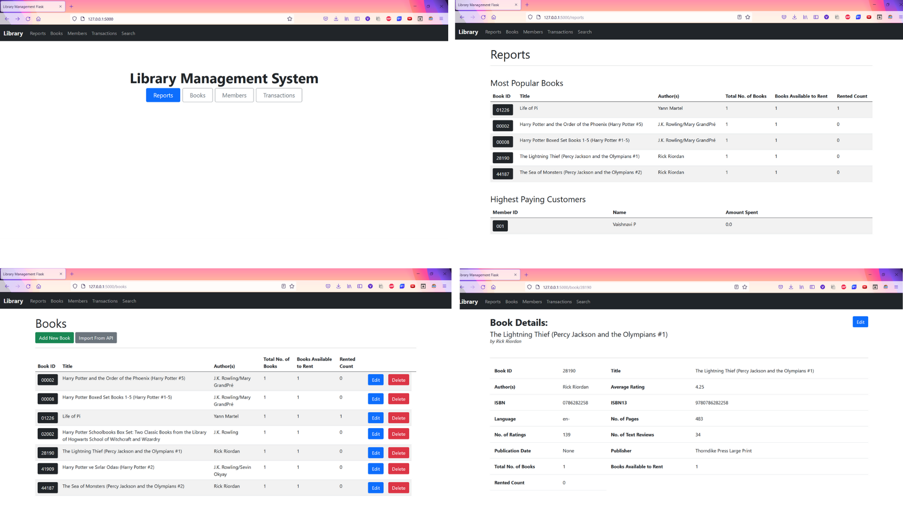

# **Library Management Flask**

## **About**
This library management system allows a librarian to track books and their quantity, books issued to members, book fees and transactions.
Built with Flask, Jinja, MySQL, API

    - Performs general CRUD operations on Books and Members.
    - Issues a book to a member.
    - Issues a book return from a member.
    - Searches for a book by name and author.
    - Charges a rent fee on book returns.
    - Makes sure a member’s outstanding debt is not more than Rs.500.


## **Getting Started**

1. Install requirements
   ```sh
   pip install -r requirements.txt
   ```
2. Setup MySQL and replace host, user, password values in `setupDB.py`, `app.py` and `test.py` as required </br></br>
3. Create Database and Tables using `setupDB.py`
   ```sh
    cd utils
    python setupDB.py
    cd ..
   ```
4. Run app
   ```sh
   python app.py
   ```

## **Screenshots:**



